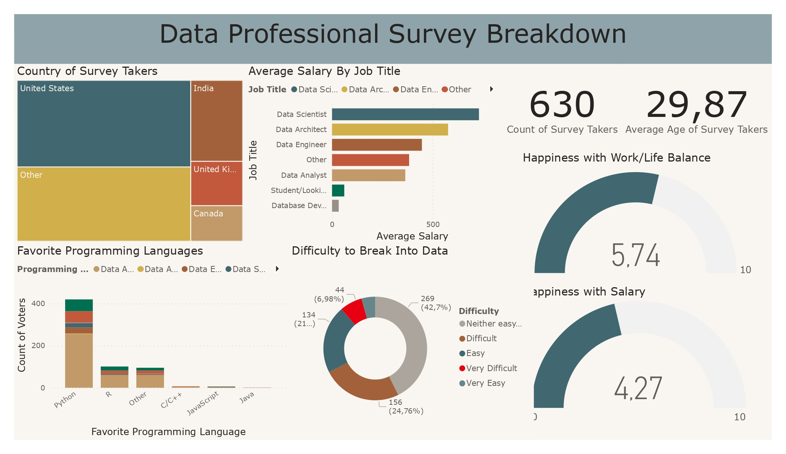

# Data-Jobs-Survey-Dashboard
The goal of this project is to build a dashboard containing visualizations from a dataset of data related jobs across many countries worldwide. There are two main parts followed in this projects, preparing the data and transforming it in **Microsoft Power Query Editor**, and building visuals in **Microsoft Power BI**.

The dataset which an Excel .xlsx format contains features such as: Unique ID, job title, current salary, industry, favorite programming language, country, etc.

The data collection process of this dataset was done through an internet survey, which allowed its takers to answer many question either by choosing from a predefined list of options, or enter their own option under a global option of "Other", which made the data value looks like: Other (Please Specify):[Entered Value].

The preparation of this dataset in Power Query Editor was done following the next steps:
- (Feature: Job title) Grouping all the user-specified options (like: Other (Please Specify:DBA)) under a single value of: Other. This step is done by splitting the column into two columns using "(" as a delimiter, at the left-most occurence, and then removing the generated columns.
- (Feature: Current Salary) This was specified as a list of ranges (for example 0-40k), we split the column, and then remove irrelevant characters.
- (Feature: Current Salary) The generated columns contain wrong values (+ value), which can be selected using the filter, and then replaced with the same value as the other generated column.
- (All features) fixing the data type.
- (Feature: Current Salary) Add a new columns of the average of the two generated columns.
- (Feature: Industry) The same as the first step.
- (Feature: Country) The same as the first step.
